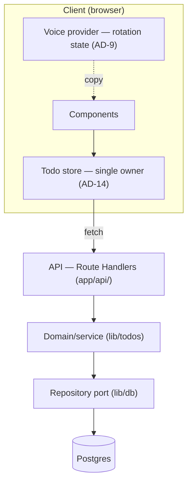
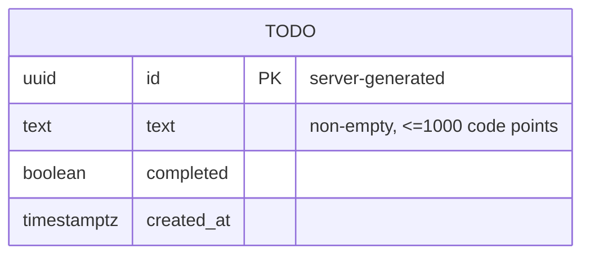

# Architecture Spine — BeMad

## Design Paradigm

**Layered architecture with a repository port**, inside a single unified Next.js (App Router) application. Dependencies flow one direction; persistence sits behind one interface; the client holds one owner for todo state and one owner for voice/rotation state.



Directory mapping: `app/` = UI + API · `lib/todos` = domain/service + shared schema · `lib/db` = repository + Drizzle impl · `lib/voice` = voice pack + rotation selector + provider · client todo store lives with the UI.

## Invariants & Rules

### AD-1 — Layered dependency direction `[ADOPTED]`
- **Binds:** all
- **Prevents:** layering violations, circular deps, UI coupling to the database
- **Rule:** dependencies flow UI → API → service → repository → Postgres, never backward. The UI never imports the DB client or repository; it reaches data only via the API. Only the repository (`lib/db`) imports the DB client.

### AD-2 — Single data-access repository `[ADOPTED]`
- **Binds:** all persistence (FR-19/21/22), health check
- **Prevents:** scattered SQL, two owners of the store, hardcoded DB coupling
- **Rule:** all reads/writes go through one `TodoRepository` interface; no SQL or DB client outside `lib/db`. DB connectivity checks are exposed as `TodoRepository.healthcheck()` (so `/api/health` respects this boundary). The store is swappable without touching UI, API, or service code.

### AD-3 — Postgres is the system of record `[ADOPTED]`
- **Binds:** persistence
- **Prevents:** ephemeral/non-durable storage; client-only state
- **Rule:** a durable, containerized Postgres instance is the source of truth, accessed server-side only, exclusively via the repository (AD-2).

### AD-4 — REST API contract
- **Binds:** FR-22, every client↔server interaction
- **Prevents:** divergent endpoint shapes, ad-hoc response/error formats
- **Rule:** Route Handlers under `app/api/todos` (collection) and `app/api/todos/[id]` (item). `GET` list · `POST` create · `PATCH` (partial update: `{ text? , completed? }`, at least one field, one logical operation per request) · `DELETE`. Success → the todo(s) as JSON with the right status (200/201/204). Errors → `{ error: { code, message } }` with a 4xx/5xx status, where `code` is a **shared enum** and `message` is **plain, un-voiced** (see AD-8 for who voices it).

### AD-5 — Shared Todo schema is the single source of truth; repository owns mapping
- **Binds:** client, API, repository
- **Prevents:** client/server shape drift; double-mapping of DB rows
- **Rule:** one TypeScript type + Zod schema for `Todo` and its create/update payloads, defined once in `lib/todos` and imported everywhere as the wire/domain shape. The **repository is the sole boundary** that maps DB `snake_case` ↔ domain `camelCase`; no other layer re-maps. Everything above the repository sees only the shared shape.

### AD-6 — Server-authoritative validation
- **Binds:** FR-9
- **Prevents:** client-only or inconsistent validation
- **Rule:** the API handler validates every mutation against the shared schema — trim whitespace, reject empty/whitespace-only, cap at 1000 code points — before it reaches the repository. The client may mirror these rules for UX but is never the authority.

### AD-7 — Optimistic mutation with rollback
- **Binds:** FR-10, FR-11, NFR-1
- **Prevents:** divergent client update strategies; operations on non-persisted tasks
- **Rule:** every mutation updates client state optimistically (visible in **≤100 ms**), then reconciles with the server (**≤500 ms p95** under normal load); on failure it rolls back per the FR-10 per-operation rules and surfaces a voiced, retryable error. **Pending tasks:** the client assigns a `tempId`; the **server-generated `id` is authoritative** and replaces the `tempId` on create success. A task is non-mutable (edit/toggle/delete disabled) until it has a server `id`; a `tempId` never occupies the `id` field.

### AD-8 — Centralized voice pack + voice-scope boundary
- **Binds:** FR-14–FR-20
- **Prevents:** scattered copy strings; the persona leaking into code/contract; un-voiced error text
- **Rule:** all user-facing copy comes from `lib/voice`, keyed to arrays of ~5 variants. No user-facing string is hardcoded in a component. Profanity is bleeped (e.g. `F***`); every variant unambiguously conveys its action (clarity beats comedy). The voice is confined to user-facing copy — API field names, error `code`/`message`, logs, identifiers, and docs stay plain. **Error display:** the client maps the API's `error.code` to voiced copy in `lib/voice`; the server never emits voiced text.

### AD-9 — Deterministic rotation selector + client-owned rotation state
- **Binds:** FR-16, FR-17
- **Prevents:** untestable randomness; `Math.random()` in components; cross-component repeat leakage; SSR hydration mismatch
- **Rule:** variant selection is a pure function `(key, lastShownIndex, rng) → variant` with the RNG injected — never repeating a variant twice in a row and keeping all variants reachable. A single client-side **voice provider** owns per-key `lastShownIndex`; components consume it and never randomize inline. Selection happens **client-side after hydration** so server and client never disagree on the rendered variant.

### AD-10 — Accessibility contract
- **Binds:** FR-17, FR-20, NFR-4
- **Prevents:** a11y regressions from rotating, shouty copy
- **Rule:** ALL-CAPS comes from CSS `text-transform`, never stored caps. Interactive controls, toasts, and the confirm/cancel dialog expose a stable, descriptive accessible name/role even as the visible label rotates. Rotation never alters text that conveys current state or selection. Target: WCAG 2.2 AA, zero critical violations.

### AD-11 — XSS-safe rendering of user text
- **Binds:** FR-1, FR-3, security review
- **Prevents:** script injection via task text
- **Rule:** task text is stored raw and rendered only through React's automatic escaping. `dangerouslySetInnerHTML` is forbidden for any user/task-derived content.

### AD-12 — Docker Compose deployment
- **Binds:** operational envelope
- **Prevents:** environment drift; non-reproducible runs
- **Rule:** the app ships as a multi-stage Dockerfile (non-root user, `HEALTHCHECK`). `docker-compose.yml` orchestrates `app` + `db` (Postgres) with a named volume, per-service health checks, and configuration via `.env` + compose profiles (`dev`/`test`). `GET /api/health` verifies DB connectivity via `TodoRepository.healthcheck()`. `docker compose up` runs the whole system.

### AD-13 — Test strategy floor
- **Binds:** NFR-1..6, QA deliverables
- **Prevents:** coverage gaps; untested critical paths
- **Rule:** Vitest for unit/integration (repository against a real test Postgres, route handlers, rotation selector, validation schema); Playwright for E2E (≥5: create, edit, toggle-complete, delete-with-confirm, empty state, loading state, error/rollback, **persistence-durability across reload + new session**); axe-core a11y assertions in Playwright. Minimum 70% meaningful coverage.

### AD-14 — Single client-side owner for todo collection state
- **Binds:** FR-2, FR-8, FR-10–FR-13
- **Prevents:** two competing client-state implementations with conflicting caches/loading/error truth
- **Rule:** exactly one client module (one hook/provider — e.g. a single data layer over `fetch`, React Query, or SWR; chosen at scaffold) owns the todo collection and its loading/error/optimistic state, including the current **sort order** (client-owned; the API returns an unordered/created-order list). Components consume this owner; no component fetches todos or tracks collection state independently.

## Consistency Conventions

| Concern | Convention |
| --- | --- |
| Naming | Files `kebab-case`; React components `PascalCase`; vars/functions `camelCase`; DB table `todos`, columns `snake_case`; TS fields `camelCase` (mapped only in the repository, AD-5). |
| Data & formats | `id` = UUID (server-generated); timestamps ISO-8601 UTC; API error shape `{ error: { code, message } }` with `code` from a shared enum; JSON everywhere. |
| UI states | Empty, loading, and error are explicit render states owned by the todo store (AD-14), each using voice-pack copy. |
| Compatibility | Responsive desktop + mobile; current evergreen browsers (NFR-5). |
| State & cross-cutting | Server owns data truth; client optimistic + rollback (AD-7); structured server logs, plain (no voice); config via env vars only; no auth in v1 but schema leaves room for an `owner` (NFR-6). |

## Stack

_Pin exact versions in `package.json`/Dockerfile at scaffold (per `project-context.md` version discipline); versions below are current-stable targets confirmed at authoring._

| Name | Version |
| --- | --- |
| TypeScript (strict) | latest stable |
| Next.js (App Router) + React | 16.x |
| Node.js runtime | 24 LTS |
| PostgreSQL | 18.x |
| Drizzle ORM (behind the repository) | 0.4x — pin exact (pre-1.0) |
| Zod (shared validation schema, AD-5/AD-6) + drizzle-zod | 4.x |
| Vitest | 4.x |
| Playwright + @axe-core/playwright | latest stable |
| Docker + Docker Compose | current |

## Structural Seed

```text
bemad/
  app/
    page.tsx               # todo list UI (client components; consume the todo store)
    api/
      todos/route.ts       # GET list, POST create
      todos/[id]/route.ts  # PATCH edit/toggle, DELETE
      health/route.ts      # GET /api/health — repo.healthcheck()
  lib/
    todos/                 # Todo type + Zod schema + service logic (shared shape)
    db/                    # TodoRepository interface + Drizzle impl + schema/migrations
    voice/                 # voice pack (keyed variant arrays) + rotation selector + provider
    store/                 # single client-side todo-collection owner (AD-14)
  tests/
    unit/  integration/  e2e/
  Dockerfile               # multi-stage, non-root, HEALTHCHECK
  docker-compose.yml       # app + db (postgres), volumes, profiles dev/test
  .env.example
```



_Schema carries `created_at` only — no `updated_at` by design (FR-7 requires creation time only; edits/toggles mutate rows in place)._

## Capability → Architecture Map

| Capability / Area | Lives in | Governed by |
| --- | --- | --- |
| Create / view / edit / toggle / delete (FR-1–7) | `app/` + `app/api/todos` + `lib/todos` + `lib/db` | AD-1, AD-2, AD-4, AD-5 |
| Sort options (FR-8) | client todo store | AD-14 |
| Validation (FR-9) | `app/api/todos` + shared schema | AD-5, AD-6 |
| Optimistic + states: instant/pending/empty/loading/error (FR-10–13) | client todo store | AD-7, AD-14 |
| Voice + rotation (FR-14–17) | `lib/voice` | AD-8, AD-9 |
| Bleep / clarity / a11y (FR-18–20) | `lib/voice` + UI | AD-8, AD-10 |
| Persistence + API (FR-19, 21, 22) | `lib/db` + `app/api` | AD-2, AD-3, AD-4 |
| Performance / reliability / a11y / fwd-compat (NFR-1–6) | cross-cutting | AD-7, AD-10, AD-12, conventions |
| Ops / deploy / health | `Dockerfile`, `docker-compose.yml`, `app/api/health` | AD-12, AD-2 |

## Deferred

- **Auth / multi-user / `owner` population** — out of v1 scope (NFR-6); schema leaves room, not built.
- **Client-state library pick** (React Query vs. SWR vs. hand-rolled) — AD-14 fixes that there is ONE owner; the specific tool is a scaffold choice.
- **Migration tooling specifics** (Drizzle Kit vs. plain SQL) — a `lib/db` implementation detail, decided at scaffold.
- **Multiple voice packs / voice switching** — future; the `lib/voice` keying already permits it.
- **CI pipeline** — the assignment runs QA locally/compose; CI config deferred unless requested.
