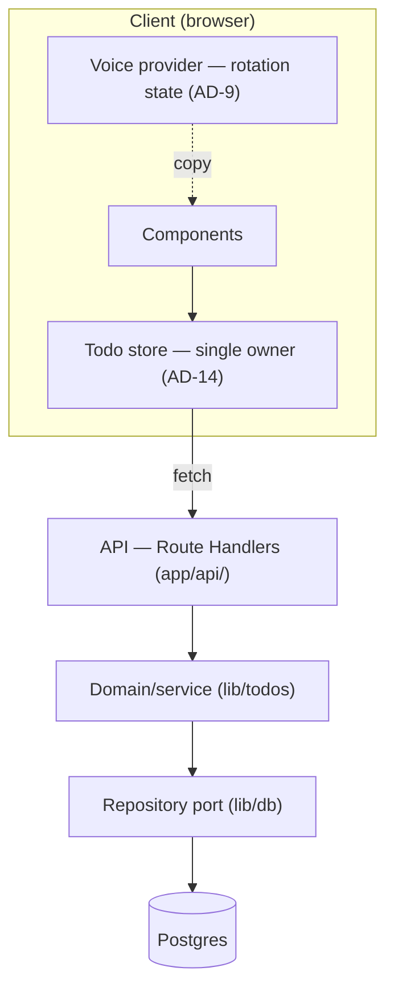

# BeMad — Architecture (Readable Overview)

_A human-readable companion to `ARCHITECTURE-SPINE.md` (the terse, authoritative contract). Where they differ, the spine wins. Decision IDs (AD-n) reference the spine._

## 1. At a glance

BeMad is a **single, unified Next.js (App Router) application** — the frontend and the API live in one deployable — backed by a **containerized PostgreSQL** database. It's a deliberately small todo app whose one distinctive feature is a **Mr. Torgue–voiced UI with rotating copy**. The architecture is a **layered design with a repository port**: a strict one-way dependency flow, all persistence hidden behind one interface, and single owners for the two pieces of client state that could otherwise fragment (todo data, and voice rotation).

## 2. Paradigm & layers (AD-1)

Dependencies flow **UI → API → service → repository → Postgres**, never backward. The UI never touches the database or the repository directly — it goes through the API. Only `lib/db` imports the database client.

## 3. Why the key decisions

- **Repository port (AD-2, AD-5).** Every read/write goes through one `TodoRepository`. This keeps SQL in one place, gives us a single spot to map DB `snake_case` to domain `camelCase`, and — importantly — makes the store swappable and easy to test against a real Postgres. The health check also runs through it (`repo.healthcheck()`) so we never open a second DB path.
- **Postgres as system of record (AD-3).** Chosen with you to satisfy durability (survives refresh/session) and to give Docker Compose a real second service. Server-side only.
- **Shared Todo schema (AD-5).** One TypeScript type + Zod schema is the single source of truth for the DB row, the API payload, and the client model — no drift.
- **Optimistic UI + rollback (AD-7).** The UI updates instantly (≤100 ms), then reconciles with the server (≤500 ms p95). Failures roll back per operation with a voiced, retryable message. Tasks that haven't been saved yet (no server `id`) can't be edited/toggled/deleted until the create resolves — a `tempId` is used client-side and replaced by the authoritative server `id`.
- **Single client-state owners (AD-14, AD-9).** One module owns the todo collection (data + loading/error/optimistic state + sort order); one voice provider owns rotation state. This is the fix for the biggest risk in a small app like this: two components independently fetching or independently rotating copy, producing conflicting truth.

## 4. The voice feature (AD-8, AD-9, AD-10)

The personality is a first-class, well-fenced subsystem:

- All copy lives in `lib/voice`, keyed to arrays of ~5 semantically-identical variants. **No user-facing string is hardcoded in a component.**
- A **deterministic, injectable-RNG selector** picks variants — never repeating twice in a row, keeping all variants reachable, and (crucially) testable without flaky randomness.
- Rotation state lives in one client-side provider and selection happens **after hydration**, so server and client never render different text (no hydration mismatch).
- **Voice-scope boundary:** the Torgue voice is confined to user-facing copy. API field names, error codes, logs, and identifiers stay plain. Errors travel as `{ error: { code, message } }` with a plain message; the **client** maps the `code` to voiced copy — the server never emits voiced text.
- **Accessibility:** ALL-CAPS is CSS `text-transform` (not stored caps); controls/toasts/dialogs keep stable, descriptive accessible names even as the visible label rotates; rotation never changes text that conveys state. Target: **WCAG 2.2 AA, zero critical**.

## 5. Data model & API

**Entity — `todos`:** `id` (UUID, server-generated), `text` (non-empty, ≤1000 code points), `completed` (boolean), `created_at` (timestamptz). No `updated_at` by design.

**API (AD-4)** — Route Handlers, JSON, consistent envelope:

| Method | Path | Purpose | Success |
| --- | --- | --- | --- |
| `GET` | `/api/todos` | list todos | 200 + array |
| `POST` | `/api/todos` | create | 201 + todo |
| `PATCH` | `/api/todos/[id]` | edit and/or toggle (partial, ≥1 field, one logical op) | 200 + todo |
| `DELETE` | `/api/todos/[id]` | delete | 204 |
| `GET` | `/api/health` | DB connectivity | 200 / 503 |

Errors: `{ error: { code, message } }` with an appropriate 4xx/5xx and a `code` from a shared enum.

## 6. Deployment (AD-12)

- **Multi-stage Dockerfile** for the app: non-root user, `HEALTHCHECK`.
- **`docker-compose.yml`** orchestrates `app` + `db` (Postgres) with a named volume for durability, per-service health checks, and configuration via `.env` + **compose profiles (`dev`/`test`)**.
- `docker compose up` brings up the whole system; `/api/health` reports readiness.

## 7. Testing & quality (AD-13)

- **Vitest** — unit/integration: repository against a real test Postgres, route handlers, the rotation selector, the validation schema.
- **Playwright** — E2E (≥5): create, edit, toggle-complete, delete-with-confirm, empty state, loading state, error/rollback, and **persistence across reload + new session**.
- **axe-core** a11y assertions inside Playwright for WCAG 2.2 AA.
- **≥70% meaningful coverage.**

## 8. Stack

TypeScript (strict) · Next.js 16 (App Router) + React · Node 24 LTS · PostgreSQL 18 · Drizzle ORM (behind the repository, pin exact — pre-1.0) · Vitest 4 · Playwright + @axe-core/playwright · Docker Compose. Pin exact versions at scaffold.

## 9. What's intentionally deferred

Auth/multi-user (schema leaves room for an `owner`, not built) · the specific client-state library (AD-14 fixes there's *one* owner; the tool is a scaffold choice) · migration tooling specifics · multiple voice packs · CI pipeline.

## 10. Framework comparison (alternatives considered)

We weighed three realistic ways to build a small full-stack React todo app before settling on unified Next.js. All three could deliver BeMad; the choice is about fit at *this* scope.

| Option | What it is | Relative benefits | Trade-offs at this scope |
| --- | --- | --- | --- |
| **React (Vite SPA) + Fastify** | Decoupled SPA and a standalone Node API | Clean FE/BE separation; Fastify is very fast (~78.5k req/s) with first-class JSON-Schema validation, hooks, and plugins; the API is reusable by other clients and scales/deploys independently; maps literally to "frontend **and** backend Dockerfiles" | Two codebases and two deploys; CORS; shared types need an extra shared package; more infra wiring and more surface to test — overkill for one single-user list |
| **Next.js 16 (App Router) + API routes** ✅ *chosen* | One unified full-stack React app | Single codebase and deploy; **shared TypeScript types across client and server for free** (AD-5); RSC/SSR; the largest ecosystem, docs, and hiring pool (lowest execution risk); least wiring; simplest Docker stack (one `app` + `db`) | API routes are less specialized than Fastify (no schema-tuned throughput); frontend and backend are coupled in one process |
| **TanStack Start** | Full-stack React on TanStack Router + Query + Vite, with type-safe server functions | Best-in-class **end-to-end type safety**; type-safe file routing and server functions remove much of the hand-written API layer; deep TanStack Query integration (caching, optimistic updates) fits our optimistic-UI need; "explicit over magic" philosophy | Youngest option (**v1.0, March 2026**, ~15% adoption); smaller ecosystem/community and fewer developers familiar with it — more risk for a graded/demo deliverable on a tight scope |

**Why Next.js won here.** For a deliberately minimal, single-user todo with one deployable, unified Next.js minimises wiring, hands us shared client/server types with no extra package (reinforcing AD-5), carries the deepest ecosystem and documentation (lowest risk for an AI-assisted build), and produces the simplest Docker Compose stack. Fastify's raw throughput and TanStack's type-safety are genuinely attractive, but neither advantage pays off at this size — and TanStack Start's newness adds avoidable risk. Worth noting: if we later adopted the TanStack stack, **TanStack Query would naturally be the single client-state owner our AD-14 already mandates**, so that decision stays portable.

_Sources: [TanStack Start v1 (docs)](https://tanstack.com/start/latest), [TanStack Start v1.0 (2026)](https://byteiota.com/tanstack-start-v1-0-type-safe-react-framework-2026/), [TanStack in 2026 decision guide](https://www.codewithseb.com/blog/tanstack-ecosystem-complete-guide-2026), [Fastify (GitHub)](https://github.com/fastify/fastify), [Fastify in Production 2026](https://www.hirenodejs.com/blog/nodejs-fastify-production-2026)._

## 11. How BMAD guided this

This spine was distilled from the PRD (`bmad-prd`) and `project-context.md`, then run through the architecture reviewer gate: a mechanical lint (clean), a good-spine rubric walk (pass), a web-backed version reality-check (corrected Node→24 LTS, Postgres→18), and an adversarial "make two conforming builders diverge" attack — which surfaced the critical need for a single client-state owner (AD-14) and several ownership seams now tightened into AD-4/5/7/8/9. See the run's `.memlog.md` and `review-*.md` for the full trail.
